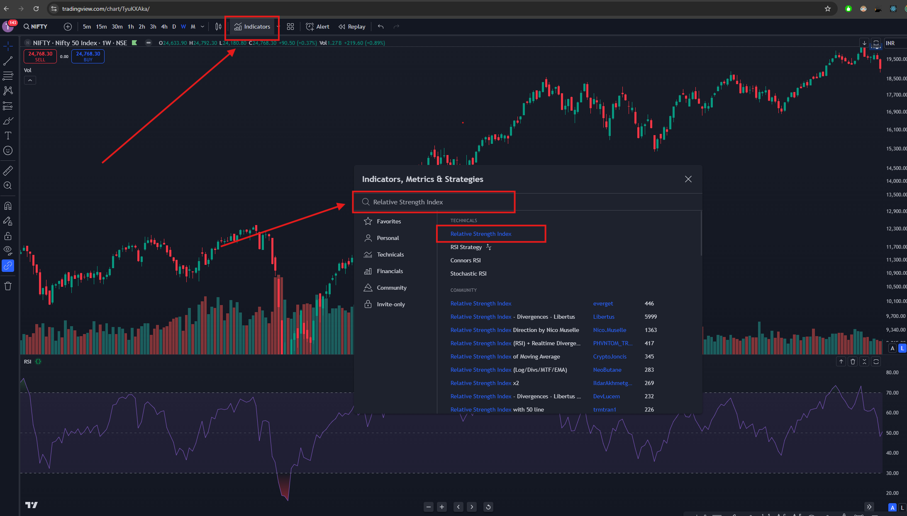
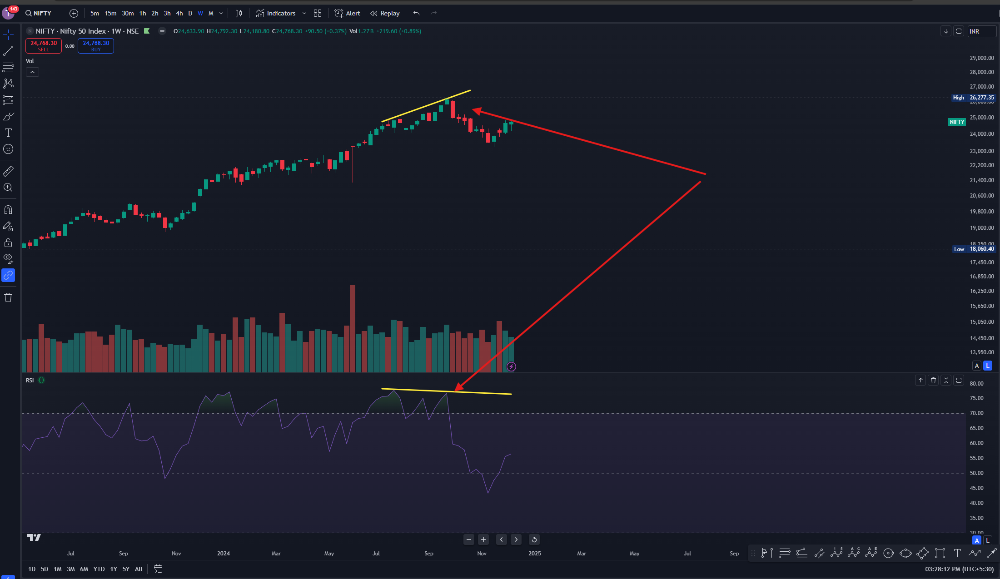
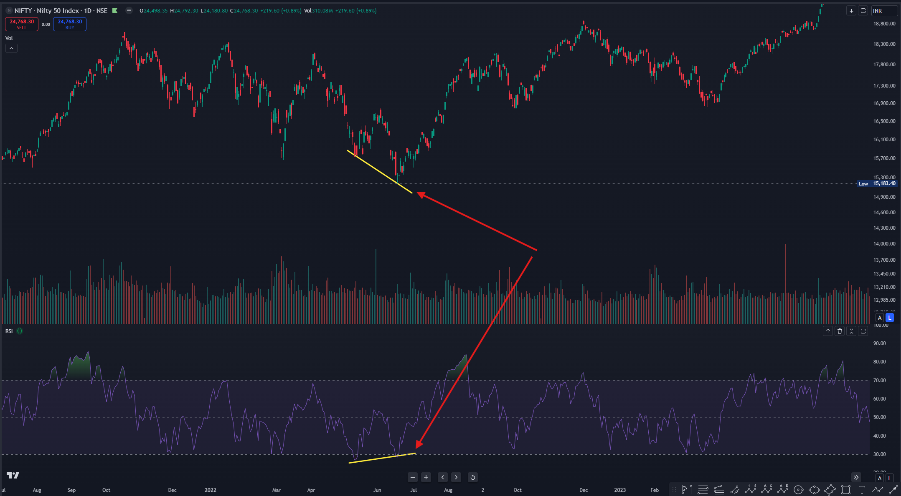

# RSI Detailed Guide: Mastering Divergences and Price Predictions

Welcome to the **detailed RSI guide**! In this resource, we'll dive deep into the nuances of the **Relative Strength Index (RSI)** and how you can use it to identify high-probability trading setups. Whether you're a beginner or an experienced trader, this guide will help you enhance your trading strategy.

---

## What You'll Learn:
1. **What is RSI and How Does It Work?**
2. **Understanding Divergences: Bullish and Bearish**
3. **Key RSI Levels: Overbought and Oversold Zones**
4. **How to Spot Divergences with High Accuracy**
5. **Confirmation Strategies for RSI-Based Trades**
6. **Advanced Tips for Using RSI in Trading**

---

## What is RSI?

The **Relative Strength Index (RSI)** is a momentum oscillator that measures the speed and change of price movements. It ranges from **0 to 100** and is widely used for identifying:
- **Overbought conditions**: RSI > 70
- **Oversold conditions**: RSI < 30

### Why is RSI Important?
RSI is a leading indicator that helps predict **potential price reversals** before they happen, giving traders an edge.

---

## How to Add RSI to Your Chart?

1. Open **TradingView**.
2. Click on **Indicators** in the toolbar.
3. Search for and select **RSI**.
4. Keep the settings as default:
   - Length: 14
   - Source: Close

   

## Understanding Divergences

### What Are Divergences?
Divergences occur when the price action and RSI indicator move in opposite directions, signaling a **potential reversal**.

#### 1. **Bearish Divergence**
   - **What it Indicates**: A potential **downtrend** is coming.
   - **How to Spot It**: Price makes a higher high, but RSI makes a lower high.
   - **Best Zone**: Look for bearish divergence when RSI > 70 (**overbought zone**) for high accuracy.

#### 2. **Bullish Divergence**
   - **What it Indicates**: A potential **uptrend** is coming.
   - **How to Spot It**: Price makes a lower low, but RSI makes a higher low.
   - **Best Zone**: Look for bullish divergence when RSI < 30 (**oversold zone**) for high accuracy.

---

## Key RSI Levels

- **Overbought Zone (RSI > 70)**: Indicates that the asset might be overvalued, signaling a potential reversal or pullback.
- **Oversold Zone (RSI < 30)**: Indicates that the asset might be undervalued, signaling a potential reversal or rally.

---

## How to Spot Divergences with High Accuracy

### Step-by-Step Process:
1. Open **TradingView** or your preferred charting platform.
2. Add the **RSI Indicator**:
   - Go to the "Indicators" section.
   - Search for **RSI** and apply it to your chart.
3. Focus on **overbought (above 70)** and **oversold (below 30)** zones.
4. Look for price making:
   - **Higher highs with lower RSI highs** (bearish divergence).
   - **Lower lows with higher RSI lows** (bullish divergence).

### Example:
Bearish Divergence example, Price created new high, but RSI did not create new high

Bullish Divergence example, Price created new low, but RSI did not create new low

## Key Notes on Using RSI

1. **Zones Matter**: 
   - Divergences are most reliable when they start from **overbought** (RSI > 70) or **oversold** (RSI < 30) zones.
   - Avoid taking trades on divergences that start in the middle of the RSI range.

2. **Confirmation is Key**: 
   - RSI divergences can persist for a long time. Always wait for a **confirmation signal** (e.g., a strong candlestick pattern or a breakout of support/resistance) before entering a trade.

3. **Combine RSI with Other Indicators**: 
   - Use RSI along with volume-based indicators (like OBV or Chaikin Money Flow) to confirm the strength of the signal.

## Confirmation Strategies for RSI-Based Trades

Divergences alone are not enough to take a trade. Always wait for confirmation:

1. **Candlestick Patterns**:
   - Look for reversal patterns such as **Doji**, **Engulfing**, or **Hammer** near divergence zones.
2. **Volume Analysis**:
   - Confirm the divergence with increased trading volume during the expected reversal.
3. **Breakouts**:
   - Wait for the price to break key **support/resistance levels** to validate the signal.

## Advanced Tips for Using RSI

1. **Multiple Timeframe Analysis**:
   - Use RSI on higher timeframes (e.g., 1D or 4H) to confirm the trend, and then switch to lower timeframes for precise entries.
   
2. **Combine RSI with Other Indicators**:
   - **MACD**: Use RSI for spotting divergences and MACD for confirming momentum shifts.
   - **Bollinger Bands**: Look for RSI divergences near Bollinger Band extremes to identify strong reversals.

3. **Dynamic Support/Resistance**:
   - Treat RSI levels like 50, 70, and 30 as dynamic support/resistance. For instance:
     - RSI crossing above 50 indicates bullish momentum.
     - RSI crossing below 50 indicates bearish momentum.

---

## Practical Examples

### Bearish Divergence Example:
1. Price makes higher highs.
2. RSI makes lower highs.
3. RSI > 70 (overbought zone).
4. Confirmation: A bearish candlestick pattern (e.g., Bearish Engulfing) forms at the divergence zone.
5. Enter a **short trade** with a stop loss above the recent high.

Bearish Divergence example, Price created new high, but RSI did not create new high

---

## Common Mistakes to Avoid

1. **Ignoring Confirmation**: Always wait for a confirmation before taking a trade. Divergences alone are not enough.
2. **Trading in Neutral Zones**: Focus on overbought/oversold zones for maximum accuracy.
3. **Overusing RSI**: Use RSI in combination with support/resistance levels or other indicators.

---

### Bullish Divergence Example:
1. Price makes lower lows.
2. RSI makes higher lows.
3. RSI < 30 (oversold zone).
4. Confirmation: A bullish candlestick pattern (e.g., Hammer) forms at the divergence zone.
5. Enter a **long trade** with a stop loss below the recent low.

Bullish Divergence example, Price created new low, but RSI did not create new low

---

## Frequently Asked Questions (FAQs)

**Q1: Can I rely solely on RSI for trading?**  
A: RSI is a great tool, but it’s best used in combination with confirmation signals like candlestick patterns or volume.

**Q2: Are RSI divergences accurate?**  
A: Yes, especially when they occur in the overbought/oversold zones. Accuracy can be 70-80% when used with confirmation.

**Q3: How do I improve my RSI strategy?**  
A: Use multiple timeframes, combine with other indicators, and backtest your strategy with historical data.

---
**Pro Tip**: Save this guide and practice identifying RSI divergences on your charts today. It’s the fastest way to master this powerful tool.

---
