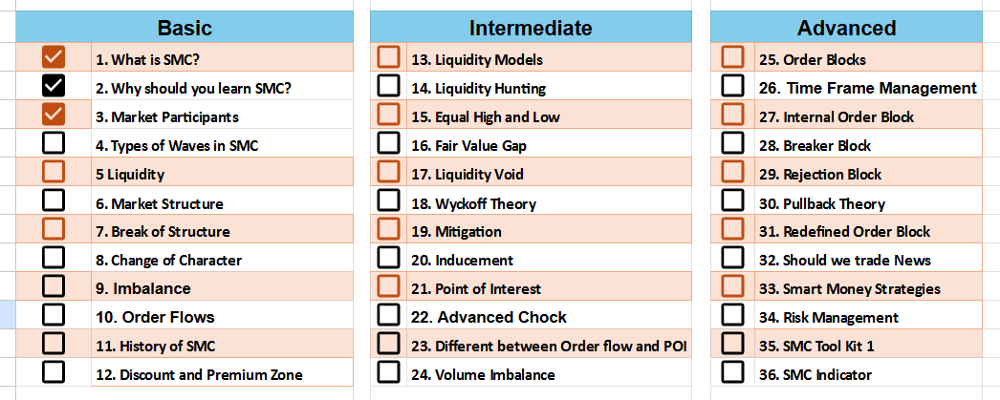

# **Smart Money Concepts - Day 1**

## **Key Question**

**Why does the market hit your stop-loss and then move straight to your target?**

The answer is simple: **Smart Money!**

This behavior is not random—it’s a deliberate move by institutional traders to manipulate retail traders.

Welcome to **Day 1 of Smart Money Concepts**, where we’ll explore how the market operates, from stop-loss hunting to understanding liquidity. Let's dive into the **basics of SMC** and build a foundation for advanced trading concepts.

---

## **The Concept of Smart Money**

Smart Money refers to **big players** in the market, like institutions, hedge funds, and banks. They control the market direction by trapping retail traders and grabbing liquidity.

Here’s how it works:

### **1. The Trapping Mechanism**

- If the market intends to move **up**, it first drops to:
  - **Hunt stop-losses** placed by retail traders.
  - **Grab liquidity** (i.e., orders stacked below support levels).
- Once liquidity is collected, the market moves sharply in its intended direction.

### **2. Liquidity and Stop-Loss Hunting**

- **Liquidity** is where a large number of orders (stop-losses, pending orders) are placed.
- The market moves to these levels to **consume liquidity** and then continues in the planned direction.

### **Example Scenario:**

- You buy near a support zone.
- The market breaks the support zone, hitting your stop-loss.
- It then reverses and moves up to your original target.
- **What happened?** Your stop-loss was hunted by Smart Money to grab liquidity!

---

## **Key Market Zones**

The market operates on the principle of **Discount Zones** and **Premium Zones**:

- **Discount Zone**: Where Smart Money buys.
- **Premium Zone**: Where Smart Money sells.

This forms the basis of **liquidity grabbing, stop-loss hunting, and market manipulation**.

---

## **Why Does This Happen?**

- The market seeks areas of **high liquidity** (where many orders are placed).
- These areas act as magnets for price movement.
- Once liquidity is grabbed, the market moves in its **true direction**.

---

## **Day 1 Takeaways**

- Stop-loss hunting is not random—it’s Smart Money grabbing liquidity.
- Liquidity zones are key to understanding market movements.
- The market moves:
  - **Down to grab liquidity** (if it wants to go up).
  - **Up to grab liquidity** (if it wants to go down).
- Always think like an **institutional trader**:
  - Identify **liquidity zones**.
  - Avoid obvious stop-loss placements.

---

## **Next Steps**

- On **Day 2**, we’ll learn:
  - What is Liquidity?
  - How to identify Liquidity Zones.
  - How to trade like institutional traders.

Stay tuned, and get ready to level up your trading game!

---

### **Bonus Tip:**

- Think of Smart Money like a chess game—they plan their moves several steps ahead. To win, you need to observe, adapt, and act with precision!

---
